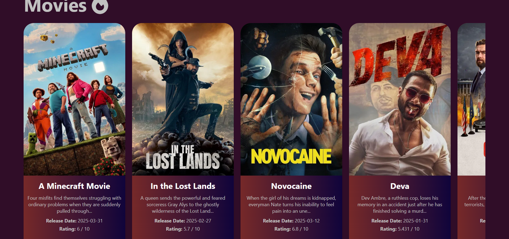
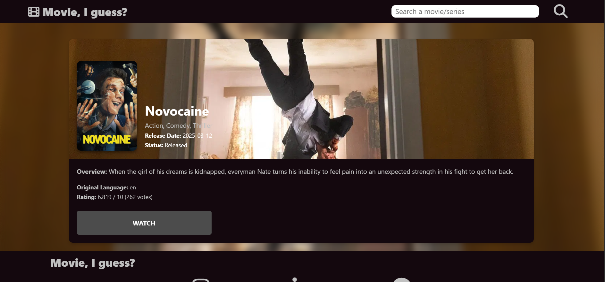
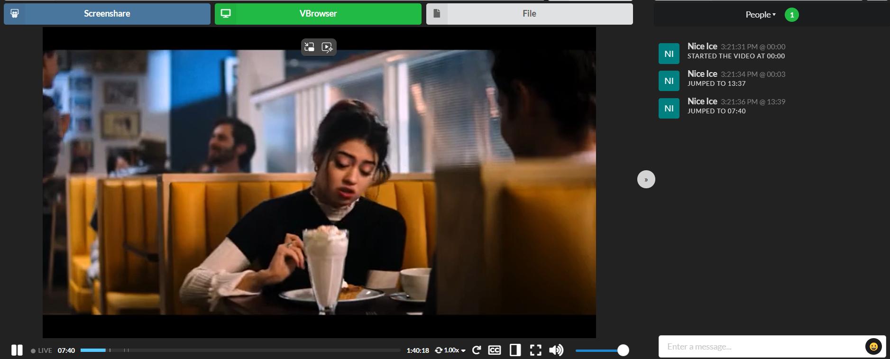

# 🎬 movieIguess

Welcome to **movieIguess**, your one-stop streaming frontend for movies and TV shows!  
Discover, watch, and host watch parties with friends – all in one sleek interface.

Link: <https://home.btfm.uk/>

---

## 🚀 Features

- 🔍 **Search & Discover**: Instantly find movies and shows using TMDB integration.
- 📺 **Watch Streaming Content**: Stream content via embedded players (proxy to strip ads).
- 👯 **Watch Party Mode**: Sync playback with friends and chat in real-time.
- 🎨 **Responsive UI**: Optimized for desktop and mobile devices.

---

## Plans in the future

- Upgrade UI
- Search Suggestions
- Accounts

---

## 🖼️ Screenshots

### Homepage  



### Movie Details Page  



### Watch Party Mode  



---

## ⚙️ Tech Stack

- Node.js + Express
- Proxy service to clean 3rd-party embeds

---

## 🛠️ Setup & Installation

### 1. Clone the repo

```bash
git clone https://github.com/infraforesightuk-eng/home.btfm.uk.git

cd home.btfm.uk
```

### 3. Setup environment variables

Create a .env file in both frontend/ and backend/ with:

# TMDB API Key

```bash
TMDB_API_KEY=your_tmdb_key
```

---

## 🛠️ Troubleshooting

### 403 Forbidden (SELinux Issues)

If you are hosting this on a system with SELinux (like RHEL, Fedora, or AlmaLinux) and encounter a **403 Forbidden** error when accessing new `.html` files (e.g., `seeall.html`), it is likely due to an incorrect security context.

This often happens if files are moved into the web root from a temporary directory. To fix this, restore the default web security context:

```bash
sudo restorecon -v /var/www/home.btfm.uk/html/seeall.html
```

Or for the entire directory:

```bash
sudo restorecon -Rv /var/www/home.btfm.uk/html/
```
